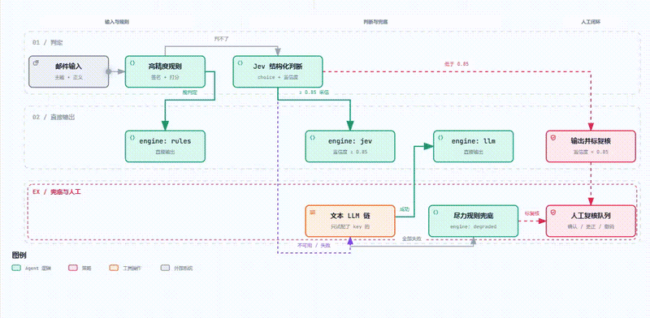
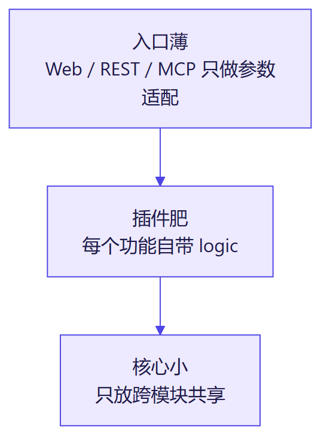
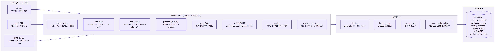
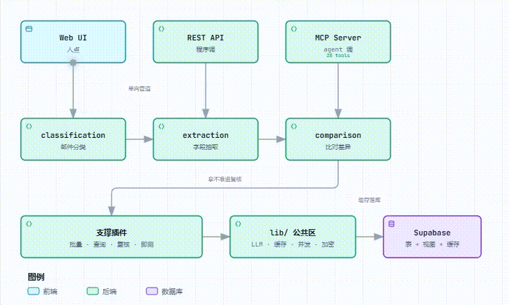
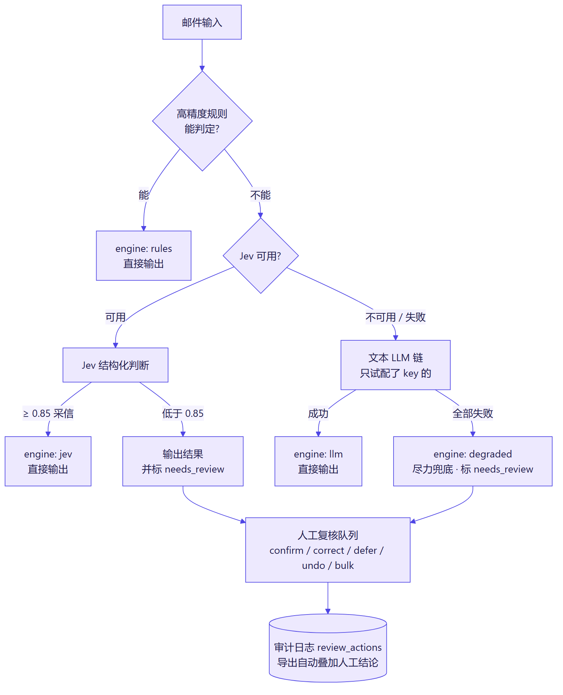
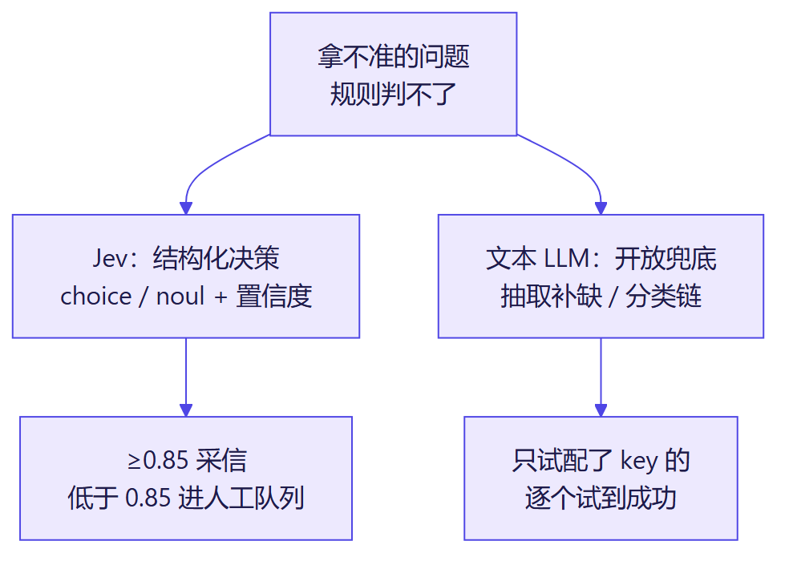
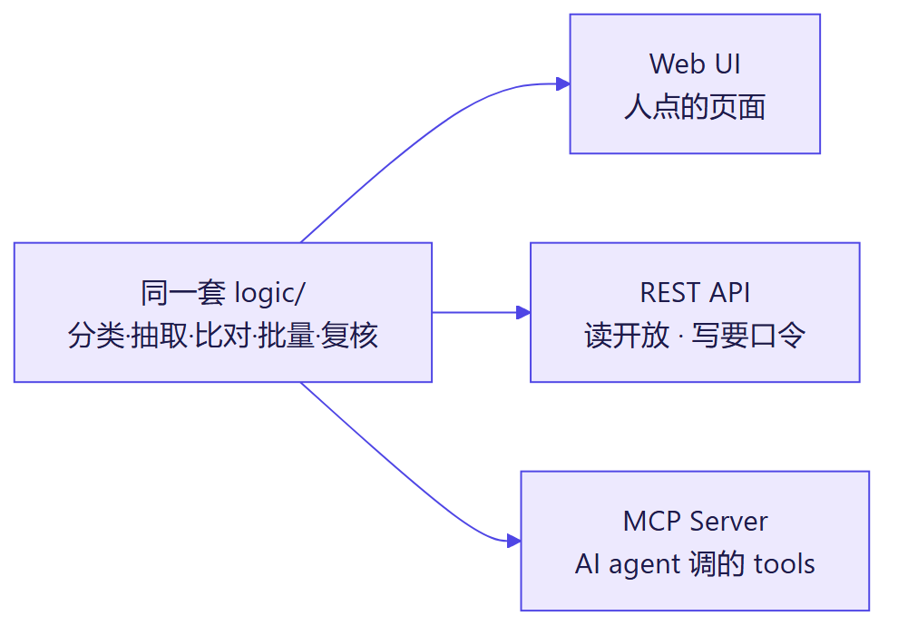
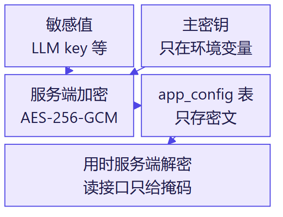
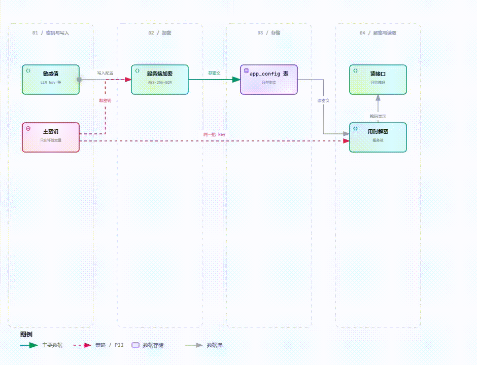

<p align="center">
  
</p>
<h1 align="center">Shipping Doc Verifier</h1>
<p align="center">航运单证核验：分类 → 抽取 → 比对，一套 logic，三种用法，三种部署</p>
<p align="center">
  <a href="https://hackathonaveris.vercel.app">Live Demo</a> ·
  <a href="#-why-its-different">Why It's Different</a> ·
  <a href="#️-architecture">Architecture</a> ·
  <a href="#-tech-stack">Tech Stack</a> ·
  <a href="docs/SHARED_INTERFACES.md">API</a> ·
  <a href="#mcp-server-streamable-http">MCP</a> ·
  <a href="#-challenges-we-solved">Challenges</a> ·
  <a href="#️-roadmap">Roadmap</a>
</p>
<p align="center">
  
  
  
  
  
  
  
  
</p>

> Averis x Monash Hackathon 2026 —— 航运单证核验。判断操作团队收到的邮件类型（SI请求 / BL确认 / 发票询问 / 一般询问 / 垃圾邮件），在 BL 确认类里比对 Shipping Instruction 和 Bill of Lading 草稿，标出不一致，拿不准就交给人工确认而不是瞎猜。详见 [OPENING_CEREMONY_NOTES.md](docs/OPENING_CEREMONY_NOTES.md)。

<p align="center">
  
</p>

> 🎬 下面是本项目的**宣传片（约2分钟，讲故事用），不是给裁判打分的依据视频**。评分以线上 demo 实测 + submission 导出为准。

<p align="center">
  <video width="800" controls src="https://user-attachments/Paste-Your-Uploaded-Video-URL-Here.mp4"></video>
</p>

<!-- 宣传片内联播放说明：GitHub README 不认仓库里的相对路径 mp4，只认网页端拖传后的 user-attachments 链接。操作：去 GitHub 网页打开 README 点铅笔 → 把 mp4 拖进编辑框 → 把生成的 user-attachments 链接贴到上面 src 里。不要换成外跳链接，保持内联播放。 -->

<!-- 图占位说明：docs/banner.png（宽横幅）、docs/demo.gif（10秒录屏：打开线上地址点 Run preview，Win 用 ScreenToGif / Mac 用 Gifski）。架构图/引擎图用 docs/diagrams/ 下的 PNG 直接展示，.mmd 是源码（改图后按文件头注释里的命令重渲染），slides 直接拿 PNG 不用重画。 -->

<details>
<summary><b>📖 目录</b></summary>

- [✨ Features](#-features)
- [⚡ Try it —— 先看线上 demo](#-try-it--先看线上-demo)
- [🎯 Why It's Different](#-why-its-different)
- [🏗️ Architecture](#️-architecture)
- [⚙️ Engine Design：规则优先，模型兜底，人工兜底的兜底](#️-engine-design规则优先模型兜底人工兜底的兜底)
- [🛳 Self Hosting —— 一份代码，三种跑法](#-self-hosting--一份代码三种跑法)
- [🧰 Tech Stack](#-tech-stack)
- [📦 Ecosystem —— 同一套 logic，三种调法](#-ecosystem--同一套-logic三种调法)
- [环境要求 / 数据导入 / 数据库初始化 / 本地评测](#环境要求)
- [REST API 与 MCP Server](#rest-api-与-mcp-server)
- [评委体验与写保护](#评委体验与写保护重要)
- [产出并自检提交文件](#产出并自检提交文件)
- [环境变量说明](#环境变量说明)
- [项目结构](#项目结构)
- [🧗 Challenges We Solved](#-challenges-we-solved)
- [🗺️ 决赛增添功能](#️-决赛增添功能)
- [📐 评分对照](#-评分对照)
- [⚖️ 设计取舍](#️-设计取舍)
- [当前状态](#当前状态)
- [🤝 Contributing](#-contributing)
- [📝 License](#-license)

</details>

## ✨ Features

| 📥 Classification 邮件分类 | 📤 Extraction 字段抽取 | 🔍 Comparison 比对+人工 |
|---|---|---|
| SI / BL确认 / 发票询问 / 一般询问 / 垃圾 | shipper / consignee / notify party / POL / POD / 箱量 / 重量 | SI vs BL 字段级差异 + 拿不准提示人工介入 |
| 规则优先 + Jev 判断 + LLM 兜底 | TXT / PDF / XLSX / DOCX 统一解析 | 缺陷字段 0 漏报 0 误报，全量 520/520 |

## ⚡ Try it —— 先看线上 demo

**评审请直接用线上地址**：https://hackathonaveris.vercel.app（评审期间保持在线）—— 进"Full pipeline 预览页"点 Run preview；想拿自己的 SI/BL 文档试：进"Sandbox"页（`/features/sandbox`），不写库、不需要任何配置。

预览不需要配任何 key：规则引擎优先，预览用的是仓库自带的样例数据（不落库）。**历史结果统计/冲突列表/导出提交文件**这些依赖数据库的功能，读的是线上已经导入好的数据，打开即看。

> 本地 / Docker 说明（可移植性证明，不是主要用法）：同一份代码不绑定 Vercel，任何机器 `npm install && npm run dev`（或 `docker compose up --build`，步骤见下文"Self Hosting"）都能跑起来。评审不需要在本地跑——线上地址就是最终交付形态。

## 🎯 Why It's Different

一个航运单证核验系统很容易被做成"读附件 → 丢给一个 LLM → 打印结果"。这个仓库刻意没有这么做，原因是评分细则里 **System Design & Architecture / Technology Integration / Engineering Quality** 三项加起来占了将近一半分数——"能跑"和"跑得有工程含量"是两件事。下面是我们和典型黑客松实现的差异，每一条都能在代码里指出具体位置，不是口号：

| 维度 | 典型黑客松做法 | 这个系统的做法 |
|---|---|---|
| 核心判断逻辑 | 一次 LLM 调用，直接产出结果，模型说什么就是什么 | 规则优先 → Jev 结构化决策（置信度校准）→ 多 LLM 兜底链 → 尽力降级并标记人工复核（见下文「Engine Design」） |
| 多 LLM 接入 | 写死一个 provider，换一个要重写调用代码 | 6 个 provider 一个统一接口（`lib/llm/index.ts`），DeepSeek / LM Studio 复用 OpenAI 协议，零重复代码 |
| 代码结构 | 网页 / API / 机器人各抄一份业务逻辑 | `logic/api/mcp/ui` 四层插件架构，同一套 `logic/` 同时喂给 Web UI + REST + MCP 三个入口 |
| 批量处理 | 要么一个个排队（慢），要么无限制并发（触发 LLM 限流、打满数据库连接） | 有界并发（`mapWithConcurrencyLimit`）+ 单条失败隔离 + 30s 软 deadline + 断点续跑（`remaining`） |
| 重复运行 | 每次都重新调用，浪费 API 成本，或者重复写入产生脏数据 | 内容指纹 + 引擎版本号增量跳过未变数据；LLM 调用按 `sha256(输入)` 缓存；结果表按 `email_id` upsert，不会有先查后插的竞态 |
| 密钥管理 | 明文写进代码或数据库 | 配置中心用 AES-256-GCM 加密敏感值，主密钥只存环境变量，从不落库、不回显 |
| 评委可操作性 | 只能看录好的视频，或者需要人陪着操作 | 读接口全开放 + 匿名 `dry_run` 预览封顶 20 封（不写库）+ sandbox 接口让评委直接拿自己的文档试，点错了也没有后果 |
| 部署可移植性 | "在我电脑上能跑"，换个环境就崩 | 同一份代码 Vercel / 本地 / Docker 三种跑法都实测过，期间真的修过两个可移植性 bug（见「Challenges We Solved」） |
| 拿不准时怎么办 | 要么强行给结论，要么直接报错 | 显式 `NEEDS_REVIEW` + 完整人工复核闭环（confirm/correct/disposition/defer/undo/bulk），全程留痕可审计（`review_actions` 表） |

## 🏗️ Architecture

一句话总结：**一切都是插件**。前端页面、后端模块都是可自由增删改的插件——每个功能自带 `logic/api/mcp/ui` 四层，只通过 [`SHARED_INTERFACES.md`](docs/SHARED_INTERFACES.md) 里约定好的接口跟别的模块对接，从不直接碰别人的内部实现。Web / REST / MCP 三个入口只是同一套 `logic/` 的三种薄适配（下图是一个漏斗，不存在"三套流程"）。config / mail / import / results / review / sandbox 六个模块都是新建文件夹接入的，没有一次靠改老代码。

<p align="center"></p>

*理念图：新能力 = 新建一个文件夹（自带 logic/api/mcp/ui），不改老代码。config / mail / import / results / review / sandbox 六个模块都是这么加进来的。源码见 [`docs/diagrams/plugin-concept.mmd`](docs/diagrams/plugin-concept.mmd)。*

<p align="center"></p>

*全景图：三个入口调的是同一套 `logic/`（模块清单见上文 Features 表），不是三套流程。源码见 [`docs/diagrams/architecture.mmd`](docs/diagrams/architecture.mmd)；做 slides 直接拿 PNG，不用重画。*

<p align="center"></p>

*动效版：上面全景图的 trace 走一遍（录自 `docs/diagrams/architecture-showcase.html`，双击可在本地交互播）。*

**约束是硬性的，不是建议**：模块之间不能互相 import 对方 `logic/` 内部实现，跨模块契约必须先写进 [`docs/SHARED_INTERFACES.md`](docs/SHARED_INTERFACES.md)；数据流方向固定成"分类 → 抽取 → 比对"单向管道，不允许反向调用（细节见 [`docs/DATA_FLOW.md`](docs/DATA_FLOW.md)）；一个文件混装路由+业务逻辑+数据库操作，或者超过约 300 行，就要按 `logic/api/mcp/ui` 拆开。这些规则记在 [`CLAUDE.md`](CLAUDE.md) 里，是团队里每个人的 AI 编程工具都要遵守的执行规范，不是写完就不看的文档。

## ⚙️ Engine Design：规则优先，模型兜底，人工兜底的兜底

判断逻辑的设计哲学是 **rules-first, models-second, humans-last**——和"直接调一次 LLM 祈祷它别出错"正好相反。以分类模块为例：

<p align="center"></p>

*图：判定口径以 [`docs/DECISION_SPEC.md`](docs/DECISION_SPEC.md) §2 为准；链顺序 gemini→deepseek→openai→claude→lmstudio（只试配了 key 的，首选排最前）。源码见 [`docs/diagrams/engine-fallback-chain.mmd`](docs/diagrams/engine-fallback-chain.mmd)。注意 Jev 低置信是直接输出+标复核，不会再进文本链。*

<p align="center"></p>

*分工图：Jev 只做结构化决策（choice/noul + 置信度），从不生成自然语言文本；开放问题走文本 LLM。源码见 [`docs/diagrams/jev-roles.mmd`](docs/diagrams/jev-roles.mmd)。*

几个关键设计决定（每条都在 [`docs/DECISION_LOG.md`](docs/DECISION_LOG.md) 里有编号记录，不是临时拍脑袋）：

- **实测全量 520 封样例邮件，规则单独就能判定所有分类**——模型只在规则没见过的邮件上才会被调用，既省成本也降低"模型幻觉"的风险面。
- **比对模块里数字字段不进模型**：Jev 实测不擅长数字比较，所以容器数量、重量这些字段用代码规范化后精确比对，只把"两段文字是不是在说同一件事"这种语义判断交给 Jev（阈值 0.85 是在样例集上调到 0 假阳性 / 0 假阴性）。
- **显式 provider 永不静默切换**：调用时指定了某个 provider，就只试那一个，失败就是失败，不会为了"看起来成功"偷偷换一个模型再骗自己。
- **失败链每一级都单独 try/catch**：一封邮件的模型调用失败，不会拖垮整批处理；`degraded` 标记会被 `retry_failed` 一键捞出来重算。
- **人工复核不是终点，是数据**：确认 / 更正 / 标记待定 / 撤销的每一步都写进 `review_actions`（append-only 审计日志），乐观锁（`updated_at`）防止两个人同时改同一条记录时互相覆盖。

## 🛳 Self Hosting —— 一份代码，三种跑法

### A. 生产部署（Vercel，主线）

仓库连到 Vercel 后，push 到 `main` 会自动部署。需要在 Vercel 项目的 Environment Variables 里，把 `.env.example` 里列的变量都配置一遍（`LM_STUDIO_BASE_URL` 除外，云端用不到）。

**线上 demo 地址**：https://hackathonaveris.vercel.app （已连 GitHub `main` 分支，push 会自动重新部署。Supabase 读权限 + service key、Jev、Gemini 都已配好并实测可用，整箱批量也能在线上真写库；Claude/OpenAI/DeepSeek 的 key 状态见「环境变量说明」）

### B. Docker 部署

```bash
cp .env.example .env   # 注意这里文件名是 .env，不是 .env.local
docker compose up --build
```

打开 http://localhost:3000 。

`.dockerignore` 会把 `node_modules` / `.next` / 真实 key（`.env*`）和官方资料包排除在构建上下文外，真实的 key 只在运行时通过 `docker compose` 的 `env_file` 注入镜像。镜像已实际构建并启动验证过（含 MCP 握手，零配置也能跑起来看核验预览）。

### C. 本地开发

```bash
npm install
cp .env.example .env.local   # 然后打开 .env.local 填真实的 key
npm run dev
```

开发模式（`npm run dev`）改代码即时生效。想在本地按"生产模式"跑（更接近线上行为、加载更快）：

```bash
npm run build && npm start
```

打开 http://localhost:3000 。没有配置任何 LLM/Supabase key 也能跑起来看界面，但涉及真实调用的功能会报错，报错信息会说明缺了哪个环境变量（分类/抽取/比对是"规则优先"，规则路径不依赖任何 key）。

## 🧰 Tech Stack

> 只写"仓库里真实在用的东西"，版本号来自 `package.json`（2026-09-21 核对）。

| 分层 | 技术 | 版本 | 一句话用途 |
|---|---|---|---|
| 全栈框架 | Next.js（App Router） | 16.3.5 | 前端页面 + 后端 API + MCP Server 跑在同一个进程里 |
| UI 库 | React / React DOM | 19.3.0 | 组件化界面（landing / dashboard / settings / pipeline 各页） |
| 样式 | Tailwind CSS（CSS-first 配置） | 4.3.3 | 响应式布局、明暗双主题，组件只用语义 token 不写裸色值 |
| 落地页动效 | GSAP + `@gsap/react` + Lenis | 3.15 / 2.1 / 1.3 | 首页滚动驱动的纸飞机叙事动画，`?motion=off` 一键降级为纯静态页 |
| AI 编排 | Vercel AI SDK（`ai`） | 7.0.106 | 统一多 LLM 文本调用入口（`generateText`） |
| AI Providers | `@ai-sdk/anthropic` / `openai` / `google` | 4.x | Claude / ChatGPT / Gemini 官方接入 |
| 结构化决策模型 | TypeSafe Jev（自研适配层） | HTTP API | 分类 `choice`、比对 `noul`，带校准概率，从不生成自然语言文本 |
| OpenAI 协议复用 | `createOpenAI`（换 baseURL） | - | DeepSeek、本地 LM Studio 零重复代码接入 |
| 数据库 / 存储 | Supabase（`@supabase/supabase-js`） | 2.116.0 | Postgres 业务表 + RLS + 私有 `uploads` bucket |
| MCP 协议 | `@modelcontextprotocol/sdk` | 1.30.0 | 28 个 tool，Streamable HTTP，无状态 |
| 参数校验 | Zod | 4.6.5 | MCP tool 输入 schema + provider 枚举校验 |
| 文档解析 | `pdf-parse`+`pdfjs-dist` / `mammoth` / `read-excel-file` | - | PDF / DOCX / XLSX 统一抽文字 |
| 加密 | Node 原生 `crypto`（AES-256-GCM） | 内置 | 配置中心敏感值加密，零额外依赖 |
| 语言 | TypeScript（strict） | 7.0.2 | 全仓库强类型，`tsc --noEmit` 是硬门禁 |
| 运行环境 | Node.js | ≥22 | AI SDK v7 的最低要求，Docker/Vercel 都对齐这个版本 |
| 部署 | Vercel + Docker（`output: standalone`） | - | 一份代码三种跑法，无 Vercel 专属 API |

**诚实声明：没用什么**——无单元测试框架（质量靠 `tsc --noEmit` + 4 个自研自检脚本：MCP 握手冒烟、加密自检、MCP 注解检查、520 封全量评测）；无 ORM、无状态管理库、无组件库（Supabase SDK 直调、React 自带 state、自研 Tailwind 组件）；Python 只存在于官方题目包（数据生成器/评分脚本），产品运行时是纯 JS/TS。这些是 4 天工期下有意的减法，写出来是因为评委问起来时，真实答案比假装什么都有更可信。

## 📦 Ecosystem —— 同一套 logic，三种调法

在 AI agent 和高度自动化的场景里，一个只能被人点的网页是不够的：业务系统要能调（REST API）、AI agent 要能调（MCP tools），三者共用同一套 `logic/`、行为完全一致。批量入口带**有界并发**（同时只跑几封，做完再补）+ 单条失败隔离，适合接自动化流水线定时跑——不会因为一封坏邮件拖垮整批，也不会把 LLM 限流打满。

| 调用方 | 入口 | 说明 |
|---|---|---|
| 人 | Web UI（`/`、`/features/sandbox`） | 响应式，手机+电脑 |
| 程序 | REST API（见下文表格） | 读开放，写要 `x-admin-token` |
| AI agent | MCP Server（`/core/mcp-server`） | Streamable HTTP，无状态，共 28 个 tool |

<p align="center"></p>

*多入口图：区别只在"谁来调、要不要口令"，业务逻辑只有一套。源码见 [`docs/diagrams/entries.mmd`](docs/diagrams/entries.mmd)。*

## 环境要求

- Node.js 22+（[nodejs.org](https://nodejs.org) 下载安装即可，安装时自带 npm；AI SDK v7 要求 Node 22 以上，Vercel/Docker 也都是 22）
- 如果要用 Docker 部署：[Docker Desktop](https://www.docker.com/products/docker-desktop/)

## 导入样例数据到 Supabase（本地跑，支持增量）

数据库分三层：`raw_emails`（原始层，邮件原样）、`parsed_attachments`（文字层，附件解析出的文字 + 扁平化文本）、`verification_results`（结果层）；另有一个只读视图 `verification_overview`（结果查询用）和内部缓存 `llm_call_cache`。前两层用导入脚本填充：

```bash
npm run import:data:dry   # 先干跑一遍：只解析 data/sample、打印统计，不写库、不需要 key
npm run import:data       # 增量导入（需要 .env.local 里填了 SUPABASE_SERVICE_ROLE_KEY）
```

每行都带内容指纹（`content_hash`）：重跑时**内容没变的行直接跳过**，只有变化的才会更新，所以随便跑、不怕重复。扫描件/损坏的 PDF 会标成 `unreadable` 先搁置，以后再处理（到时候重跑脚本即可自动补上）。

另一条路是**开发者模式**（`/features/devmode` 页面，或直接调 `POST /features/devmode/api/wipe` / `/restore`）：清空核验数据表（不可逆）、或清空后从 `data/sample/` 重导入恢复成官方样例状态。需要 `x-admin-token` + 页面里手动打字输入确认短语双重确认，仅供内部/评委验证用，不是产品功能，故意不进主导航（细节见 [SHARED_INTERFACES.md](docs/SHARED_INTERFACES.md)「开发者模式」）。

## 数据库初始化（新环境 / 换 Supabase 项目必读）

现有正式项目已经建好表，**不需要重跑**；只有在换/新建 Supabase 项目时才按这里重建，并把权限核对一遍：

1. **建表**（控制台 SQL Editor 按顺序全部粘贴执行，脚本都可重复执行）：
   - `scripts/core-schema.sql`：**先跑这个**——核心三表（`raw_emails` / `parsed_attachments` / `verification_results`）、只读视图 `verification_overview`、缓存表 `llm_call_cache`，以及三张业务表的 anon select 策略（`llm_call_cache` 故意不给 anon 策略，只走 service role）
   - `scripts/phase2-schema.sql`：第二阶段 4 张业务表（`app_config` / `mail_accounts` / `supabase_projects` / `uploaded_documents`）
   - `scripts/phase2-rls.sql`：给上面 4 张表启用 RLS，并给 `uploaded_documents` 建 anon select 策略
   - `scripts/review-schema.sql`：人工复核闭环两张表（`review_overrides` / `review_actions`）
   - 跑完后再执行一次 `npm run import:data` 把 `data/sample/` 的样例邮件+附件导入 `raw_emails`/`parsed_attachments`（`verification_results` 由后续跑分类/抽取/比对时写入）
2. **Storage**：Storage → 确认 bucket `uploads` 存在（private），并到 Storage → Policies 核对/记录它的访问策略（以控制台实际策略为准）。
3. **anon 只读探测**（用匿名 key 访问，验证"读全开放"没配错）：
   ```bash
   curl -s "<项目URL>/rest/v1/verification_overview?select=email_id&limit=1" \
     -H "apikey: <NEXT_PUBLIC_SUPABASE_ANON_KEY>"
   ```
   期望：200 且返回一行 JSON；若 401/403 或报错，回看第 1 步的视图/RLS 策略。
4. **服务端 key**：导入/写库需要 `SUPABASE_SERVICE_ROLE_KEY`（只放服务端环境变量，绝不能加 `NEXT_PUBLIC_` 前缀）。

## 本地评测（对照官方 ground_truth 自测）

```bash
npm run evaluate              # 全量跑 520 封：增量跳过没变的邮件，对照 ground_truth 出分数，并写入 verification_results
npm run evaluate -- --force   # 强制重算
npm run evaluate -- --limit=50  # 只跑前 50 封（调试）
npm run evaluate -- --no-write  # 只算分，不写库
```

ground_truth 仅用于本地自测：官方已明确确认题目包（含 `ground_truth.json`）允许参赛者使用，唯一约束是它只用于自测、绝不进最终提交文件（口径见 `AGENTS.md`/`CLAUDE.md`「评审沉淀」⑤）。
当前成绩（2026-09-20）：分类 macro-F1 100%、端到端 520/520、缺陷字段 100%/100%/100%。

各判断点的选项与定义、程序/模型判定标准、模型输入（扁平化）契约，统一记录在 [DECISION_SPEC.md](docs/DECISION_SPEC.md)。

## REST API 与 MCP Server

查询/统计/冲突对/导出（`app/features/results/`，只读）统一从这里访问，接口格式见 [SHARED_INTERFACES.md](docs/SHARED_INTERFACES.md)「results 模块」：

| REST（GET） | 作用 |
|---|---|
| `/features/results/api` | 按分类/状态/处理情况查结果列表（含未处理邮件），支持排序、分组、分页 |
| `/features/results/api/stats` | 总数 / 已处理 / 未处理 / 失败 / 分类分布 / 状态分布 / 差异字段频次 |
| `/features/results/api/conflicts` | 冲突文件对（SI/BL 不一致 + 需要人工确认），带两边字段值 |
| `/features/results/api/export` | Save as：`scope=results\|conflicts\|stats\|submission` × `format=json\|md\|txt\|csv`（`scope=submission` 仅支持 json；`csv` 在 `scope=conflicts` 下是"一行=一个待改字段"的 amendment list，列出 email_id/si_value/bl_value/为什么判定）；完整性看响应头 `X-Export-Incomplete` / `X-Export-Expected-Source`（submission 场景） |

整箱批量入口（`POST /features/pipeline/api`，会写结果表）：
不传参数 = 全量增量跑（跳过没变的），`limit` 控制单次几封，`dry_run: true` 只算不写：

```bash
# 匿名预览（不需要口令）：单次最多 20 封、不写库——适合评委/访客体验
curl -X POST http://localhost:3000/features/pipeline/api \
  -H "Content-Type: application/json" \
  -d '{"dry_run":true,"limit":50}'

# 写模式（会写库）：带服务端口令；冷缓存全量会被 30s deadline 分成多轮，重复调用自动增量续跑
curl -X POST http://localhost:3000/features/pipeline/api \
  -H "Content-Type: application/json" \
  -H "x-admin-token: <ADMIN_TOKEN>" \
  -d '{"email_ids":["email_004","email_059"],"dry_run":false}'
```

响应里的 `remaining` = 还没跑完的数量；`stopped_by_deadline=true` 表示这一轮被 30s deadline 截断，再调一次即可（写模式会跳过已经算好的）。**dry_run / 匿名预览不写库、每次只预览前 20 封；要攒齐完整体必须用写模式（带口令）分批续跑**（模型结果走 `llm_call_cache` 复用）。

单文档接口（分类/抽取/比对，只能对着仓库自带样例数据用）GET 同一地址可以看用法，POST 示例：

```bash
curl http://localhost:3000/features/classification/api            # GET：接口用法说明
curl -X POST http://localhost:3000/features/classification/api \
  -H "Content-Type: application/json" \
  -d '{"email_id":"email_004"}'
```

**想拿自己的 SI/BL 文档测（不是仓库自带样例）**，用 sandbox 接口——不写库、不需要配置 Supabase：

```bash
curl -X POST http://localhost:3000/features/sandbox/api \
  -H "Content-Type: application/json" \
  -d '{"subject":"Please confirm BL","body":"See attached SI and draft BL","si":{"name":"my_si.txt","data_base64":"<base64>"},"bl":{"name":"my_bl.txt","data_base64":"<base64>"}}'
```

格式见 [SHARED_INTERFACES.md](docs/SHARED_INTERFACES.md)「pipeline 模块（批量入口）」「sandbox 模块」。写保护规则见下文「评委体验与写保护」。人工复核闭环（`/features/<m>/api/review/*`，四个模块都有）见 [REVIEW_SPEC.md](docs/REVIEW_SPEC.md)。

### MCP Server (Streamable HTTP，无状态)

```
本地：http://localhost:3000/core/mcp-server
线上：https://hackathonaveris.vercel.app/core/mcp-server
```

共 28 个 tool（`npm run test:mcp-annotations` 会打出实时的读/写清单和总数，这里给个分类速查）：

| 类型 | tool |
|---|---|
| 单文档核验（只读，4个） | `classify_email` / `extract_document_fields` / `compare_documents` / `run_adhoc_test`（自带 SI/BL 测试，不写库） |
| 结果查询（只读，4个） | `list_results` / `get_stats` / `list_conflicts` / `export_results` |
| 人工复核闭环（P1-1，4模块×4个=16个；`list_*`/`get_*_review_history` 只读，`apply_*`/`undo_*` 写库） | `list_<m>_review` / `get_<m>_review_history` / `apply_<m>_review_action` / `undo_<m>_review_action`（`<m>` = classification/extraction/comparison/pipeline） |
| 其余（1只读+3写库） | `list_uploaded_documents`（只读）/ `run_batch` / `sync_gmail` / `classify_uploaded_document`（写库） |

写库的 tool（`readOnlyHint:false`）都需要 `x-admin-token`；只有 `run_batch` 的 `dry_run=true` 允许匿名预览。

Claude Desktop 等 MCP client 直接把这个地址填成远程 MCP server 即可（GET/DELETE 返回 405 是正常的，无状态模式只接受 POST）。

本地和线上是**同一份代码、同一条路径** `/core/mcp-server`，区别只在主机地址和环境变量（本地读 `.env.local` / Docker 的 `.env`，线上读 Vercel 的 Environment Variables）。
验证握手用同一个脚本，只换地址：

```bash
# 本地（先 npm run dev / npm start，或 Docker 跑在 3000 端口）
npm run mcp:smoke

# 线上 Vercel 部署
npm run mcp:smoke -- https://hackathonaveris.vercel.app/core/mcp-server
```

脚本会依次做 initialize → notifications/initialized → tools/list → 真实调用 `get_stats`。线上 `get_stats` 能不能出数据取决于 Vercel 的 Supabase 环境变量，握手本身不受影响。

## 评委体验与写保护（重要）

- **读接口全部开放**：结果查询/统计/冲突对/导出、MCP 的只读 tool，访客直接可看，不需要口令
- **匿名可以跑 `dry_run` 预览**：`POST /features/pipeline/api {"dry_run":true}` 和 MCP `run_batch {dry_run:true}` 不需要口令，单次自动封顶 **20 封**、不写库——适合现场体验流水线
- **写操作需要口令**：请求头 `x-admin-token: <ADMIN_TOKEN>`。`ADMIN_TOKEN` 未配置时**所有写操作一律拒绝（403）——这是安全特性，不是缺陷**；口令错误返回 401
- **写业务数据需要口令；LLM 调用结果缓存 `llm_call_cache` 会被匿名只读接口顺带写入**（缓存键包含输入指纹，无法伪造他人结果）
- 公开网页默认只做 dry_run 预览，**不做**"自动带口令写库"的入口；写模式只走 REST/MCP 手动带口令
- 用 MCP 客户端连写 tool 时，把口令配在客户端的 headers 里（各客户端写法不同，例如 `mcp-remote --header "x-admin-token: <ADMIN_TOKEN>"`，或客户端自定义 header 配置），不要把口令下发给浏览器
- `ADMIN_TOKEN` 已在 Vercel（production + preview）和本地 `.env.local` 配好；换环境部署时记得补

<p align="center"></p>

*加密图：主密钥只在环境变量（永不进库/进 git/回显），库里只有密文，加密和解密用同一把 key，实现在 `lib/shared/crypto.ts`。源码见 [`docs/diagrams/encryption.mmd`](docs/diagrams/encryption.mmd)。*

<p align="center"></p>

*动效版：写入链→读取链走一遍（录自 `docs/diagrams/encryption-showcase.html`）。*

## 产出并自检提交文件

```bash
curl -sD headers.txt -o submission.json \
  "https://hackathonaveris.vercel.app/features/results/api/export?scope=submission&format=json"
# 检查 headers.txt：
#   X-Export-Items: 520
#   X-Export-Incomplete: false
#   X-Export-Expected-Source: sample
# 可选：用官方资料包里的评分脚本自评（路径以题目包为准）
```

- 要 520 封完整体：**带口令、非 dry_run 分批续跑**（`remaining` 递减）；**dry_run/匿名重跑不累积**（每次只预览前 20 封、不写库）
- `X-Export-Incomplete=true` 时看 `X-Export-Missing` / `X-Export-Stale` / `X-Export-Expected-Source`：缺失的、旧版本引擎的结果行需要重跑后再导出；Expected-Source 不是 `sample` 说明函数包里没读到样例清单，即使 Missing=0 也按不完整处理

## 环境变量说明

见 [.env.example](.env.example)，逐条列了每个变量是干嘛的。简单说：

| 变量 | 说明 |
|---|---|
| `NEXT_PUBLIC_SUPABASE_URL` / `NEXT_PUBLIC_SUPABASE_ANON_KEY` | 去 [supabase.com](https://supabase.com) 建免费项目，Project Settings → API 里找 |
| `SUPABASE_SERVICE_ROLE_KEY` | 服务端专用，导入/写库用，绝不能加 `NEXT_PUBLIC_` 前缀 |
| `ANTHROPIC_API_KEY` / `OPENAI_API_KEY` / `DEEPSEEK_API_KEY` / `GOOGLE_GENERATIVE_AI_API_KEY` | 不需要全填，缺哪个只是那个 provider 选不了；demo 默认兜底是 Gemini |
| `TYPESAFE_API_KEY` / `JEV_MODEL` | Jev 结构化决策，见 `lib/llm/jev.ts` |
| `LM_STUDIO_BASE_URL` | 只有本地/Docker 有用，默认 `http://localhost:1234/v1`，Vercel 用不了本地模型 |
| `ENCRYPTION_MASTER_KEY` / `ADMIN_TOKEN` | 配置中心加密 + 写保护口令，见 `.env.example` 注释 |

配置中心的「当前接线状态」（避免误解）：现在只有测试连接与配置 CRUD 会消费 `llm.*_api_key`；`provider_priority` / 阈值 / `pipeline.*` / `storage.*` 目前仍是**展示项**，改了不会立刻改变运行时行为（运行时用的是代码里的常量/环境变量）。

## 项目结构

```
/app
  /core            全局布局、导航、MCP server 汇总注册（公共区，改动前先跟队友确认）
  /features
    /classification  邮件分类模块
    /extraction      字段抽取模块
    /comparison      比对+人工确认模块
    /pipeline        批量编排入口（分类→抽取→比对的唯一顺序定义处）
    /results         结果查询/统计/冲突对/导出（只读，REST + MCP 共用一套 logic）
    /sandbox         评委自带 SI/BL 文档临时测试（不写库）
    /config /mail /import  配置中心 / 邮箱与多Supabase管理 / 文档上传
    /jev-lab         Jev 结构化决策验证页
    每个模块内部分 logic/（业务逻辑）api/（HTTP接口）mcp/（MCP tool定义）ui/（网页组件）
/lib
  /shared          跨模块共享的类型定义、工具函数、人工复核闭环实现（review/）
  /llm             多LLM统一调用层 + Jev 适配
/data/sample       官方提供的样例邮件数据（参赛者安全版，不含答案）
/scripts           本地工具脚本（导入样例数据到 Supabase、DDL、自检脚本，不参与线上运行）
```

完整的架构规范和约束见 [CLAUDE.md](CLAUDE.md)；`docs/` 下所有文档的目录、权威状态与维护规则见 [docs/README.md](docs/README.md)。

## 🗺️ 决赛增添功能

初赛提交时功能冻结，下面是决赛阶段按优先级往里加的东西（每条都是新增/扩展一个模块，不动现有流程）。完整版见 [`docs/FINALS_ROADMAP.md`](docs/FINALS_ROADMAP.md)：

- [ ] **空白占位符规则加固**（最高优先）—— 修复 Challenges 第 4 条，扩展占位符正则并同步抽取 prompt 与 `DECISION_SPEC.md`
- [ ] **多种子回归评测** —— 用官方数据生成器换随机种子造新样例，提前在自己机器上按官方评分脚本的口径做一次"决赛模拟考"
- [ ] **批量测试集上传**（sandbox 模块第二步）—— 让评委一次上传一整箱新邮件跑完整批量流水线，而不只是当前单条文档即测（见 [`docs/UI_GUIDE.md`](docs/UI_GUIDE.md) §2.8，单条版已完成）
- [ ] **Gmail 只读摄取**（手动触发）—— 演绎"操作团队每天要在 2000 封邮件里翻找"这个真实痛点，接口已就绪、真实 OAuth 授权待接
- [ ] **扫描件 OCR**（演示模式，默认关闭）—— 只作预览建议值，绝不改写系统的 `unreadable` 判定结果
- [ ] **运行审计表**（`pipeline_runs`）—— 配合人工复核的审计日志，做出一条完整可追溯的处理链路
- [ ] **DCSA eBL 3.0 字段映射导出** —— 面向行业标准的方向性路线，目前只是路线图，不是"已集成"
- [ ] **本地决策模型 Laya 的评估结论**：这次不接入——规则已经覆盖 520/520 样例邮件，真正需要模型兜底的调用量很小，接入本地决策模型的性价比在当前阶段不高；但 5 个具体接入点（新增 `lib/llm/laya.ts`、provider 注册位、门控条件、Docker profile、`.env.example` 条目）已经在决策记录里写清楚，将来做是"加一个文件"，不是"改架构"

## 🧗 Challenges We Solved

四天工期里遇到的几个真实工程问题，写出来是因为"怎么发现的、根因是什么、怎么修的"比"最后能跑"更能说明工程能力：

1. **PDF 在 Serverless / Docker 环境下解析失败，本地开发时却是好的。** 根因：Next.js 的打包器在生产构建时会丢掉 `pdf-parse`/`pdfjs-dist` 依赖的 `pdf.worker.mjs` 文件，开发模式不走同一套打包流程所以没暴露问题。修法：在 `next.config.mjs` 把这两个包声明为 `serverExternalPackages` 并显式 `outputFileTracingIncludes`，之后在 Vercel 和 Docker 镜像里都重新验证过。
2. **人工复核导出链路在全量数据下返回 400。** 一开始用 PostgREST 的 `.in("email_id", [...几百个id])` 查询已复核记录，小数据测试没问题；接入全量 520+ 封邮件的真实导出请求后线上直接报 `Bad Request`。根因：`.in()` 的数组会被序列化进 URL 查询字符串，几百个值超出了 URL 长度限制。修法：改成拉取该类型的全部复核记录（这张表本身很小，只有真正被人工处理过的行）再在内存里按 `Set` 过滤，避免了"先查后判断"的方案在数据量上的隐患。
3. **Vercel 环境变量不是实时生效的。** 给 DeepSeek 配了 API key 之后线上一直报"缺少环境变量"，一度怀疑是 key 本身有问题；后来确认根因是 Vercel 的环境变量改动只在**下一次部署**之后才会应用到正在运行的函数——配置的时间点晚于最近一次部署，所以还在用旧的运行时环境。这提醒我们：改了 Vercel 配置后，验证之前记得先触发一次新部署。
4. **官方边界样本里的"空白占位符"没被规则识别。** 复验发现规则引擎会把 `???`、`TBC`、`____MT` 这类"形式上是文本、语义上是空值"的占位符当成真实字段值参与比对，一旦官方换测试数据的随机种子，这些占位符落在文本字段上就会产生假阳性 `MISMATCH`。这是上方「决赛增添功能」第一条（最高优先修复项）。
5. **Jev 结构化决策模型不擅长数字比较。** 比对模块最初考虑让 Jev 统一判断"两个值是否等价"，实测后发现它在数字类字段上不够可靠。改为：数字字段（箱量、重量）用代码规范化后精确比对，只把"这两段文字说的是不是同一件事"这种语义等价判断交给 Jev，置信度阈值 0.85 是在样例集上校准到 0 假阳性 / 0 假阴性得出的，不是拍脑袋定的。

## 📐 评分对照（演示前自查用，非自评得分）

官方初赛评分 = 技术 70 + 产品与影响力 30。这张表只说明"每一项我们准备了什么证据"，供上台前自查：

| 官方评分项 | 分值 | 我们的证据 |
|---|---|---|
| System Design & Architecture | 15 | 「Architecture」一节的插件化设计 + 数据流单向管道约束（`docs/DATA_FLOW.md`）；第二阶段 6 个模块全部以"新增文件夹"方式接入，没有一次靠改老代码 |
| Working Core Prototype | 25 | 线上可直接点开的 `POST /features/pipeline/api {dry_run:true}` 全流程预览，520 封样例邮件端到端跑通 |
| Technology Integration | 15 | 6 provider 统一 LLM 接口 + Jev 结构化决策 + Supabase/Vercel/Docker 三向部署，含两个真实修复过的可移植性 bug |
| Technical Feasibility & Validation | 15 | 全量评测 520/520、缺陷字段 0 漏报 0 误报；「Challenges We Solved」记录真实问题的发现与修复过程 |
| Problem Statement Understanding | 10 | SI/BL 缺陷比对工作流 + `NEEDS_REVIEW` 人工交接机制，对应真实操作团队"邮件多、拿不准要有人兜底"的痛点 |
| Innovation & Solution Approach | 10 | 「Why It's Different」差异化对照表：规则优先混合引擎 + fail-closed 的 MCP 写保护 + 加密配置中心 |
| Practical Value & Potential | 10 | 导出文件的 `decided_by` 透明度字段、完整性自检响应头、面向行业标准（DCSA eBL 3.0）的路线图 |

## ⚖️ 设计取舍（为什么暂时不这么做）

下面每条都是有意的取舍，不是做不到——每条都写了"为什么当前解法更好"：

- **本地模型只在本地/Docker 部署里生效**——Vercel 的机器没有 GPU，也访问不到你笔记本的 `localhost`，这是无服务器平台的物理限制。分工因此很清楚：云端 demo 用云端模型（Gemini/Jev，已配好），想玩本地模型就在自己电脑跑（步骤见上文）。决赛 slide 里"接 GPU 云主机跑开源模型"就是这条的延伸路线。
- **扫描件 OCR 只做"演示模式"且默认关闭**——OCR 读出来的字可能是错的，绝不能让它改写系统对损坏文档的 `unreadable` 判定：错了就标出来给人看，比"看起来识别了、实则给错答案"可信得多。
- **数字字段（箱量/重量）不做模糊容差**——官方注入的缺陷恰恰是小量级差异（箱数 ±1、重量数百 kg），加了容差等于主动漏检；文字表述差异才需要语义判断，这部分交给 Jev（阈值 0.85，在样例集上校准到 0 误报 0 漏报）。

## 当前状态

- 引擎完成：规则优先 + Jev 判断 + LLM 兜底；全量评测 **520/520 端到端一致、缺陷字段 0 漏报 0 误报**（见上文"本地评测"）
- 数据层就绪：`raw_emails` / `parsed_attachments` / `verification_results` 三张表 + 只读视图 `verification_overview` + 内部缓存表 `llm_call_cache`，导入脚本支持增量
- 查询/统计/冲突对/导出（results 模块）REST + MCP 已就绪；MCP server 已接上真正的 Streamable HTTP 握手（共 28 个 tool）
- 人工复核闭环（P1-1）REST+MCP+GUI 全部就绪（四模块 confirm/correct/disposition/defer/undefer/note/rerun/undo/bulk，`/features/review` 一个页面按 tab 切换四模块），见 [REVIEW_SPEC.md](docs/REVIEW_SPEC.md)
- sandbox 接口（评委自带 SI/BL 文档临时测试，不写库不需要 Supabase）已就绪，含 GUI（`/features/sandbox`）
- 内部"开发者模式"后端 + GUI 已就绪（`/features/devmode`，数据库清空/恢复成官方样例状态，**不是产品功能**，仅供团队/评委验证用；持续可见警示条 + 打字确认短语 + 口令三重门槛，刻意不接 MCP，故意不进主导航，详见 [SHARED_INTERFACES.md](docs/SHARED_INTERFACES.md)「开发者模式」）
- 整箱批量入口已就绪：`POST /features/pipeline/api` + MCP `run_batch`（增量跳过没变的、单封失败不拖垮整批、失败也留痕；`dry_run` 可只算不写）
- 部署验证：MCP 握手 + 全部 tool、结果查询/导出、提取（TXT/PDF/XLSX/DOCX）、Jev/Gemini 分类、整箱批量，已在本地 `next start`、Docker 镜像和线上 Vercel 上实测通过
- 已修的两个服务端 bug：见「Challenges We Solved」第 1、2 条
- LLM key：本地缺 `ANTHROPIC_API_KEY` 等云端 LLM key（没配时自动降级、不影响规则路径）；Vercel 上 Supabase service key、Jev（`TYPESAFE_API_KEY`）和 Gemini 已配好并实测可用（含 `run_batch` 真写库）。`DEEPSEEK_API_KEY` 已在 Vercel 填入，Claude/OpenAI 还没填（选这几个 provider 会返回可读的缺 key 错误）
- 第二阶段（功能已合并，详见 [PHASE2_SPEC.md](docs/PHASE2_SPEC.md)）：**config 配置中心**（GUI 可调、敏感值 AES-256-GCM 加密、读开放/写口令保护）、**mail 占位接口**（Gmail 连接状态 + 多 Supabase 项目切换与停用恢复）、**import 文档上传**（单件/多选/文件夹、校验链、内容哈希去重、按内容识别 SI/BL、原文件存 Storage）。新增业务表与 `uploads` bucket（RLS 脚本见 `scripts/phase2-rls.sql`；线上实际策略以控制台为准）。
  - **线上写入已配置**：`ENCRYPTION_MASTER_KEY` / `ADMIN_TOKEN` 已加进 Vercel（production + preview），线上实测：无口令写入 401、带口令可写、敏感值加密存储；本地 `.env.local` 有同样的值。如需在其他环境部署，记得补这两个变量（见 `.env.example`）
  - GUI（配置页/上传页/人工复核页/sandbox页）由队友A负责接入：**先看 [docs/UI_GUIDE.md](docs/UI_GUIDE.md)**；字段级契约见 [SHARED_INTERFACES.md](docs/SHARED_INTERFACES.md) 的 config / mail / import / review / sandbox 章节

## 🤝 Contributing

团队协作规则见 [CLAUDE.md](CLAUDE.md)（AI 必读），人类看的分工手册见 [docs/TEAM_HANDBOOK.md](docs/TEAM_HANDBOOK.md)，模块间接口约定见 [docs/SHARED_INTERFACES.md](docs/SHARED_INTERFACES.md)，数据流见 [docs/DATA_FLOW.md](docs/DATA_FLOW.md)，决策记录见 [docs/DECISION_LOG.md](docs/DECISION_LOG.md)。

## 📝 License

MIT，见 [LICENSE](LICENSE)。
