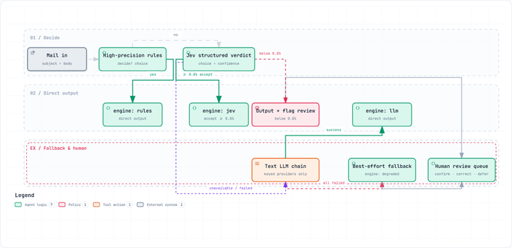
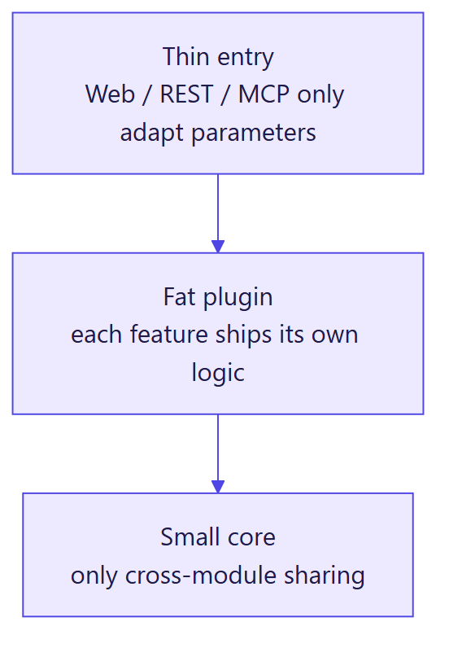
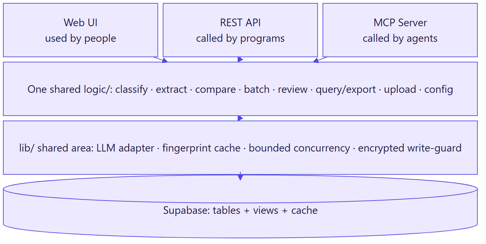
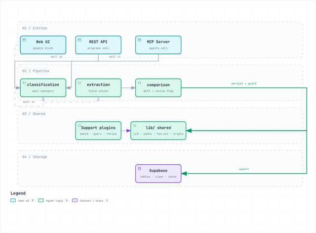
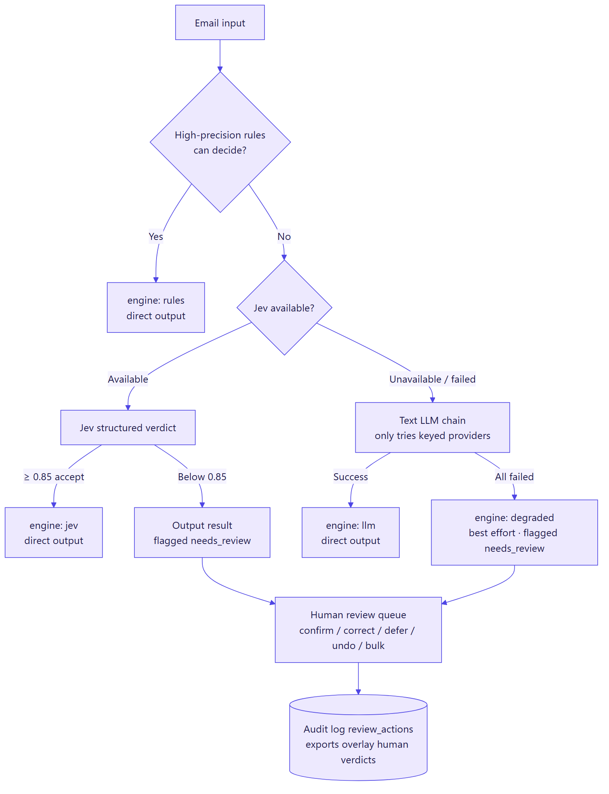
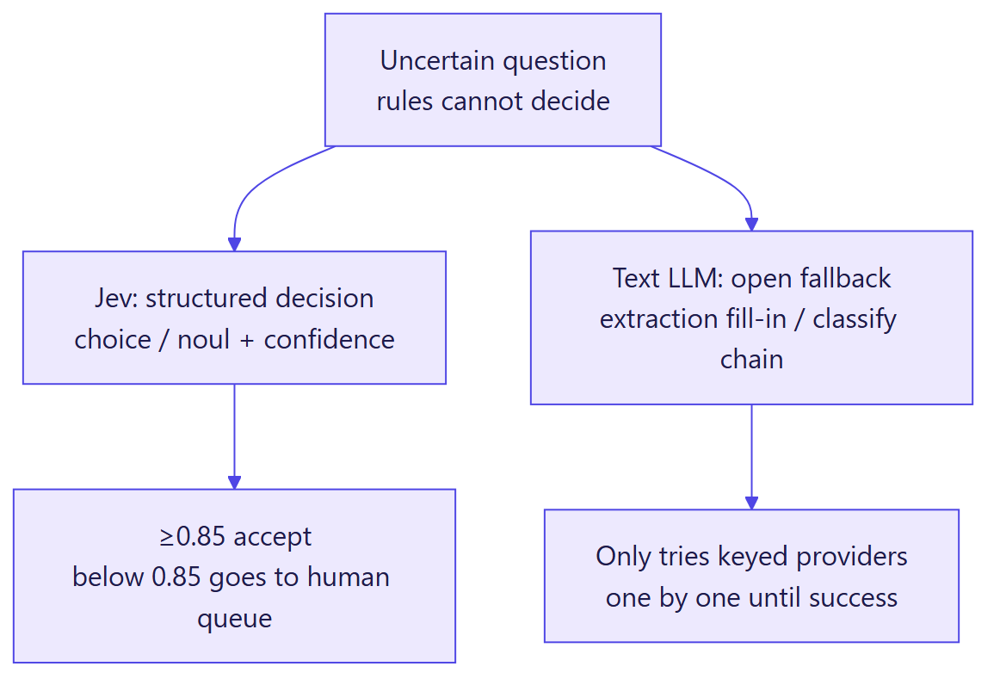
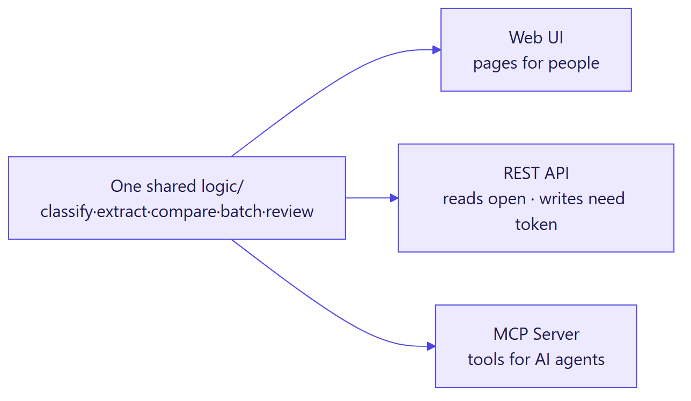
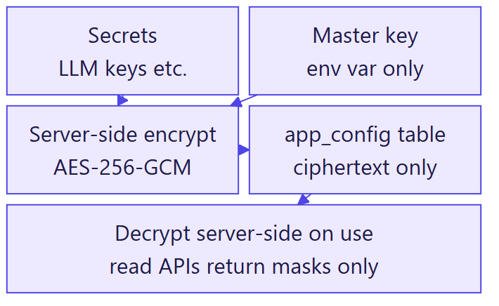
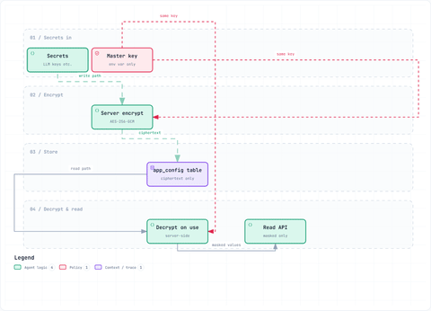

<p align="center">
  
</p>
<p align="center"><a href="README_zh.md">中文版</a> | English (this file)</p>
<h1 align="center">Shipping Doc Verifier</h1>
<p align="center">Shipping document verification: classify → extract → compare. One logic/, three ways to use it, three ways to run it.</p>
<p align="center">Team: <strong>Cat on Lime</strong></p>
<p align="center">
  <a href="https://hackathonaveris.vercel.app">Live Demo</a> ·
  <a href="#-why-its-different">Why It's Different</a> ·
  <a href="#️-architecture">Architecture</a> ·
  <a href="#-tech-stack">Tech Stack</a> ·
  <a href="docs/SHARED_INTERFACES.md">API</a> ·
  <a href="#rest-api--mcp-server">MCP</a> ·
  <a href="#-challenges-we-solved">Challenges</a> ·
  <a href="#️-finals-roadmap">Roadmap</a>
</p>
<p align="center">
  
  
  
  
  
  
  
  
</p>

> Averis x Monash Hackathon 2026 — shipping document verification. It classifies incoming mail for the ops team (SI request / BL confirmation / invoice inquiry / general inquiry / spam), and for BL confirmations it compares the Shipping Instruction against the draft Bill of Lading, flagging mismatches. Anything uncertain goes to a human instead of guessing. Background in [OPENING_CEREMONY_NOTES.md](docs/OPENING_CEREMONY_NOTES.md) (Chinese).

<p align="center">
  
</p>

> 🎬 **Official demo video (submission requirement, ≤5 minutes)** — team & project name, the problem and why it matters, tech stack, a live walkthrough of the prototype, and impact/metrics/results.

<p align="center">
  <em>🚧 Placeholder — the official judge-facing demo video will be embedded here before submission.</em>
</p>

<!-- JUDGE VIDEO PLACEHOLDER: once the real video is ready, open this README on github.com, hit edit (pencil),
     drag the mp4 into the editor to get a github.com/user-attachments/... link, then replace the <em> line
     above with: <video width="800" controls src="PASTE_LINK_HERE"></video>
     Keep inline playback, don't switch to an outbound link (same rule as the promo video below). -->

> 🎬 Below is a separate **promo video (~2 minutes, storytelling only — NOT judging material)**. Judging is based on the official demo video above, the live demo, and the submission export.

<p align="center">
  <video width="800" controls src="https://github.com/user-attachments/assets/f7e4e417-85d0-435d-9798-1a4af1f2d808"></video>
</p>

<!-- Inline-video note: GitHub READMEs don't play repo-relative mp4 files, only user-attachments links created by dragging the mp4 into the GitHub web editor. To replace: open README on github.com, hit edit, drag the mp4 in, paste the generated link into the src above. Keep inline playback, don't switch to an outbound link. -->

<!-- Media: docs/banner.png (wide banner, placeholder). Animated diagrams are recorded from docs/diagrams/*-showcase.en.html (open locally for the interactive version). Architecture/engine diagrams render from docs/diagrams/*.en.mmd to *.en.png (re-render with the command in each .mmd header); slides reuse the PNGs directly. -->

<details>
<summary><b>📖 Contents</b></summary>

- [✨ Features](#-features)
- [⚡ Try It — Start With the Live Demo](#-try-it--start-with-the-live-demo)
- [🎯 Why It's Different](#-why-its-different)
- [🏗️ Architecture](#️-architecture)
- [⚙️ Engine Design: Rules First, Models as Backup, Humans as the Last Resort](#engine-design-rules-first-models-as-backup-humans-as-the-last-resort)
- [🛳 Self Hosting — One Codebase, Three Ways to Run](#-self-hosting--one-codebase-three-ways-to-run)
- [🧰 Tech Stack](#-tech-stack)
- [📦 Ecosystem — One Shared logic/, Three Ways to Call It](#-ecosystem--one-shared-logic-three-ways-to-call-it)
- [Requirements / Data Import / Database Setup / Local Evaluation](#requirements)
- [REST API & MCP Server](#rest-api--mcp-server)
- [Judge Experience & Write Protection](#judge-experience--write-protection)
- [Producing and Self-Checking the Submission File](#producing-and-self-checking-the-submission-file)
- [Environment Variables](#environment-variables)
- [Project Structure](#project-structure)
- [🧗 Challenges We Solved](#-challenges-we-solved)
- [🗺️ Finals Roadmap](#️-finals-roadmap)
- [📐 Scoring Rubric Mapping](#-scoring-rubric-mapping-pre-demo-self-check-not-a-self-score)
- [⚖️ Design Trade-offs](#️-design-trade-offs-what-we-deliberately-dont-do-and-why)
- [Current Status](#current-status)
- [🤝 Contributing](#-contributing)
- [📝 License](#-license)

</details>

## ✨ Features

| 📥 Classification | 📤 Extraction | 🔍 Comparison + human handoff |
|---|---|---|
| SI / BL confirmation / invoice inquiry / general inquiry / spam | shipper / consignee / notify party / POL / POD / container count / weight | Field-level SI vs BL diffs + review flag when uncertain |
| Rules first + Jev verdict + LLM fallback | Unified parsing for TXT / PDF / XLSX / DOCX | Defect fields: 0 missed, 0 false alarms, 520/520 end to end |

## ⚡ Try It — Start With the Live Demo

**Judges: please use the live URL**: https://hackathonaveris.vercel.app  (kept online during judging) — open the "Full pipeline preview" page and hit Run preview. To try your own SI/BL documents: open the "Sandbox" page (`/features/sandbox`), no database writes, no setup needed.

The preview needs no keys: the rules engine runs first and the preview uses the sample data shipped in the repo (nothing is written to the DB). **Historical stats / conflict list / submission export** read data already imported into the hosted database — just open and look.

> Local / Docker notes (portability proof, not the main path): the same codebase runs anywhere with `npm install && npm run dev` (or `docker compose up --build`, steps under "Self Hosting"). Judges don't need to run anything locally — the live URL is the deliverable.

## 🎯 Why It's Different

A shipping-doc verifier is easy to build as "read attachment → throw at one LLM → print result". This repo deliberately doesn't do that, because **System Design & Architecture / Technology Integration / Engineering Quality** add up to nearly half the score — "it runs" and "it's engineered" are two different things. Below is how we differ from a typical hackathon build; every row points at real code, not slogans:

| Dimension | Typical hackathon build | This system |
|---|---|---|
| Core decision logic | One LLM call produces the result; whatever the model says goes | Rules first → Jev structured decision (calibrated confidence) → multi-LLM fallback chain → graceful degrade with human-review flag (see "Engine Design") |
| Multi-LLM access | One hardcoded provider; switching means rewriting call code | 6 providers behind one interface (`lib/llm/index.ts`); DeepSeek / LM Studio reuse the OpenAI protocol, zero duplicated code |
| Code structure | Web / API / bot each copy the business logic | `logic/api/mcp/ui` plugin layers; the same `logic/` feeds Web UI + REST + MCP |
| Batch processing | Either one-by-one (slow) or unbounded concurrency (LLM rate limits, DB connection exhaustion) | Bounded concurrency (`mapWithConcurrencyLimit`) + per-item failure isolation + 30s soft deadline + resumable runs (`remaining`) |
| Re-runs | Re-call everything (burns API budget) or duplicate writes (dirty data) | Content fingerprints + engine-version incremental skip; LLM calls cached by `sha256(input)`; result tables upserted by `email_id`, no read-then-insert races |
| Secret management | Plaintext in code or database | Config center encrypts secrets with AES-256-GCM; master key lives only in env vars, never in the DB, never echoed |
| Judge operability | A prerecorded video, or a guided tour with someone standing by | All read APIs open + anonymous `dry_run` preview capped at 20 mails (no writes) + sandbox API so judges can test their own documents with zero consequences |
| Deploy portability | "Works on my machine", breaks anywhere else | Same codebase verified on Vercel / local / Docker, including two portability bugs actually fixed along the way (see "Challenges We Solved") |
| When uncertain | Either force an answer or crash | Explicit `NEEDS_REVIEW` + full human review loop (confirm/correct/disposition/defer/undo/bulk), fully logged and auditable (`review_actions` table) |

## 🏗️ Architecture

One sentence: **everything is a plugin**. Pages and backend modules are freely addable/removable plugins — each feature ships its own `logic/api/mcp/ui` layers and talks to other modules only through interfaces agreed in [`SHARED_INTERFACES.md`](docs/SHARED_INTERFACES.md), never by touching their internals. Web / REST / MCP are just three thin adapters over the same `logic/` (the diagram below is a funnel — there are no "three pipelines"). The config / mail / import / results / review / sandbox modules were all added as new folders, never by editing old code.

<p align="center"></p>

*Concept: new capability = new folder (with its own logic/api/mcp/ui), old code untouched. config / mail / import / results / review / sandbox all joined this way. Source: [`docs/diagrams/plugin-concept.en.mmd`](docs/diagrams/plugin-concept.en.mmd).*

<p align="center"></p>

*Overview: the three entries call the same `logic/` (module list in the Features table above) — not three pipelines. Source: [`docs/diagrams/architecture.en.mmd`](docs/diagrams/architecture.en.mmd); slides reuse the PNG directly.*

<p align="center"></p>

*Animated: the trace walks the pipe once (recorded from `docs/diagrams/pipeline-showcase.en.html` — open it locally for the interactive version).*

**Constraints are hard rules, not suggestions**: modules must not import each other's `logic/` internals; cross-module contracts go into [`docs/SHARED_INTERFACES.md`](docs/SHARED_INTERFACES.md) first; data flows one way down the "classify → extract → compare" pipe, no reverse calls (see [`docs/DATA_FLOW.md`](docs/DATA_FLOW.md), Chinese); any file mixing routes + business logic + DB access, or growing past ~300 lines, gets split along `logic/api/mcp/ui`. These live in [`CLAUDE.md`](CLAUDE.md) (Chinese) as execution rules every teammate's AI tooling must follow — not write-once docs.

## ⚙️ Engine Design: Rules First, Models as Backup, Humans as the Last Resort

The design philosophy is **rules-first, models-second, humans-last** — the opposite of "call an LLM once and pray". Using classification as the example:

<p align="center"></p>

*Figure: criteria per [`docs/DECISION_SPEC.md`](docs/DECISION_SPEC.md) (Chinese) §2; chain order gemini→deepseek→openai→claude→lmstudio (only tries providers with keys configured, preferred first). Source: [`docs/diagrams/engine-fallback-chain.en.mmd`](docs/diagrams/engine-fallback-chain.en.mmd). Note: low-confidence Jev outputs directly + flags review, never entering the text chain.*

<p align="center"></p>

*Roles: Jev only makes structured decisions (choice/noul + confidence) and never generates natural-language text; open questions go to text LLMs. Source: [`docs/diagrams/jev-roles.en.mmd`](docs/diagrams/jev-roles.en.mmd).*

Key design decisions (each recorded with an ID in [`docs/DECISION_LOG.md`](docs/DECISION_LOG.md), Chinese — none made up on the spot):

- **On all 520 sample mails, rules alone decide every classification** — models only run on mail the rules haven't seen, saving cost and shrinking the "model hallucination" surface.
- **Numeric fields never go to the model in comparison**: Jev tested poorly at number comparison, so container counts and weights are normalized in code and compared exactly; only semantic questions ("are these two texts saying the same thing?") go to Jev (threshold 0.85, tuned on the sample set to 0 false positives / 0 false negatives).
- **An explicit provider never silently switches**: if you asked for a provider, only that one is tried; failure is failure — no secretly swapping in another model to fake success.
- **Every fallback level has its own try/catch**: one mail's model failure can't take down the batch; `degraded` rows are picked up for recompute with one `retry_failed`.
- **Fallback is time-boxed so it actually gets to run**: a model is retried once only for fast transient errors (rate limit / 5xx / network — never for a hang); inside the fallback chain each model gets at most 15 s and the whole chain 22 s (numbers calibrated on live latency: Gemini field extraction normally takes 8–10 s, so a tighter cut would mistake a slow-but-working model for a dead one). So a stuck first-choice model hands over to the next one in ~15 s, and if everything is down the step still ends inside the platform's 30 s limit with a flagged best-effort answer, instead of the whole request being killed. Both classification and field extraction use the chain.
- **Human review isn't the end, it's data**: every confirm / correct / disposition / defer / undo lands in `review_actions` (append-only audit log), with optimistic locking (`updated_at`) so two people editing the same row can't silently overwrite each other.

## 🛳 Self Hosting — One Codebase, Three Ways to Run

### A. Production (Vercel, the main line)

Once the repo is connected to Vercel, pushing to `main` auto-deploys. Fill in every variable from `.env.example` in the Vercel project's Environment Variables (`LM_STUDIO_BASE_URL` excluded — the cloud can't use it).

**Live demo**: https://hackathonaveris.vercel.app (tracks GitHub `main`, redeploys on push. Supabase read access + service key, Jev, Gemini and DeepSeek are configured and verified live; full batch can really write online. Claude and ChatGPT are deliberately not configured — see below).

> **Why Claude and ChatGPT have no API key on the demo.** Their APIs are the most expensive of the five providers, and a public demo that anyone can click would bill every call to the team. The integration itself is complete: both are in the provider list, go through the same `lib/llm` interface, and join the fallback chain automatically as soon as a key is added in Vercel — no code change. Until then, choosing either returns a readable "missing `ANTHROPIC_API_KEY` / `OPENAI_API_KEY`" message and the fallback chain simply skips them. The live text-model chain is Gemini → DeepSeek (plus Jev for structured decisions); none of this affects the 520 sample emails, which the rules decide on their own.

### B. Docker

```bash
cp .env.example .env   # note: .env here, not .env.local
docker compose up --build
```

Open http://localhost:3000 .

`.dockerignore` keeps `node_modules` / `.next` / real keys (`.env*`) and the official problem pack out of the build context; real keys enter the image only at runtime via `docker compose` `env_file`. The image has actually been built and boot-verified (including the MCP handshake; the verification preview runs with zero config).

### C. Local development

```bash
npm install
cp .env.example .env.local   # then open .env.local and fill in real keys
npm run dev
```

Dev mode (`npm run dev`) hot-reloads. To run locally in "production mode" (closer to hosted behavior, faster loads):

```bash
npm run build && npm start
```

Open http://localhost:3000 . It runs without any LLM/Supabase keys for the UI, but features needing real calls will error with a message naming the missing env var (classify/extract/compare are "rules first" — the rules path needs no keys).

## 🧰 Tech Stack

> Only what's really in the repo; versions from `package.json` (checked 2026-09-21).

| Layer | Tech | Version | One-line purpose |
|---|---|---|---|
| Full-stack framework | Next.js (App Router) | 16.3.5 | Pages + API + MCP server in one process |
| UI library | React / React DOM | 19.3.0 | Component UI (landing / dashboard / settings / pipeline pages) |
| Styling | Tailwind CSS (CSS-first config) | 4.3.3 | Responsive layout, light+dark themes; components use semantic tokens, no raw color values |
| Landing motion | GSAP + `@gsap/react` + Lenis | 3.15 / 2.1 / 1.3 | Scroll-driven paper-plane narrative on the homepage; `?motion=off` degrades to a pure static page |
| AI orchestration | Vercel AI SDK (`ai`) | 7.0.106 | Single entry for multi-LLM text calls (`generateText`) |
| AI providers | `@ai-sdk/anthropic` / `openai` / `google` | 4.x | Official Claude / ChatGPT / Gemini access |
| Structured decision model | TypeSafe Jev (custom adapter) | HTTP API | Classification `choice`, comparison `noul`, with calibrated probabilities; never generates prose |
| OpenAI-protocol reuse | `createOpenAI` (swapped baseURL) | - | DeepSeek and local LM Studio with zero duplicated code |
| Database / storage | Supabase (`@supabase/supabase-js`) | 2.116.0 | Postgres tables + RLS + private `uploads` bucket |
| MCP protocol | `@modelcontextprotocol/sdk` | 1.30.0 | 28 tools, Streamable HTTP, stateless |
| Param validation | Zod | 4.6.5 | MCP tool input schemas + provider enum checks |
| Document parsing | `pdf-parse`+`pdfjs-dist` / `mammoth` / `read-excel-file` | - | Unified text extraction for PDF / DOCX / XLSX |
| Encryption | Node built-in `crypto` (AES-256-GCM) | built-in | Config-center secret encryption, zero extra deps |
| Language | TypeScript (strict) | 7.0.2 | Strong types repo-wide; `tsc --noEmit` is a hard gate |
| Runtime | Node.js | ≥22 | Minimum for AI SDK v7; Docker/Vercel aligned |
| Deploy | Vercel + Docker (`output: standalone`) | - | One codebase, three ways to run, no Vercel-only APIs |

**Honest disclosure of what we DON'T use** — no unit-test framework (quality comes from `tsc --noEmit` + 4 homegrown self-check scripts: MCP handshake smoke, crypto self-test, MCP annotation check, 520-mail full evaluation); no ORM, no state-management lib, no component lib (direct Supabase SDK calls, built-in React state, homegrown Tailwind components); Python exists only in the official problem pack (data generator / scoring script) — the product runtime is pure JS/TS. These are deliberate subtractions under a 4-day budget; writing them down beats pretending we have everything when a judge asks.

## 📦 Ecosystem — One Shared logic/, Three Ways to Call It

Where AI agents and automation are concerned, a clickable web page isn't enough: business systems need to call it (REST API), AI agents need to call it (MCP tools) — all three sharing one `logic/` with identical behavior. The batch entry uses **bounded concurrency** (only a few mails at a time, refilling as each finishes) + per-item failure isolation, fit for scheduled pipelines — one bad mail can't sink the batch or trip LLM rate limits.

| Caller | Entry | Notes |
|---|---|---|
| People | Web UI (`/`, `/features/sandbox`) | Responsive, mobile + desktop |
| Programs | REST API (tables below) | Reads open, writes need `x-admin-token` |
| AI agents | MCP Server (`/core/mcp-server`) | Streamable HTTP, stateless, 28 tools |

<p align="center"></p>

*Multi-entry: the only differences are "who calls, token or not" — there is exactly one business logic. Source: [`docs/diagrams/entries.en.mmd`](docs/diagrams/entries.en.mmd).*

## Requirements

- Node.js 22+ ([nodejs.org](https://nodejs.org) — npm ships with it; AI SDK v7 needs Node 22+, Vercel/Docker match)
- For Docker: [Docker Desktop](https://www.docker.com/products/docker-desktop/)

## Importing Sample Data into Supabase (Local, Incremental)

Three DB layers: `raw_emails` (raw, mail as-is), `parsed_attachments` (text layer, attachment text + flattened text), `verification_results` (results); plus a read-only view `verification_overview` (for queries) and an internal cache `llm_call_cache`. The first two layers are filled by the import script:

```bash
npm run import:data:dry   # dry run first: parses data/sample, prints stats, no writes, no keys needed
npm run import:data       # incremental import (needs SUPABASE_SERVICE_ROLE_KEY in .env.local)
```

Every row carries a content fingerprint (`content_hash`): re-runs **skip unchanged rows**, only changed ones update — rerun freely, no duplicates. Scanned/broken PDFs are marked `unreadable` and set aside for later (rerunning the script picks them up automatically).

The other path is **dev mode** (the `/features/devmode` page, or `POST /features/devmode/api/wipe` / `/restore` directly): wipes verification tables (irreversible) or wipes-then-restores the official sample state from `data/sample/`. Needs `x-admin-token` plus typing a confirmation phrase in the page — internal/judge verification only, not a product feature, deliberately absent from the main nav (see [SHARED_INTERFACES.md](docs/SHARED_INTERFACES.md) "dev mode", Chinese).

## Database Setup (New Environment / Switching Supabase Projects)

The hosted project already has its tables — **don't rerun this**; only follow it when rebuilding on a new/changed Supabase project, then re-verify permissions:

1. **Create tables** (paste each script in order in the console SQL Editor; all scripts are re-runnable):
   - `scripts/core-schema.sql`: **run first** — core tables (`raw_emails` / `parsed_attachments` / `verification_results`), read-only view `verification_overview`, cache table `llm_call_cache`, plus anon-select policies on the three business tables (`llm_call_cache` deliberately has no anon policy — service role only)
   - `scripts/phase2-schema.sql`: phase-2 tables (`app_config` / `mail_accounts` / `supabase_projects` / `uploaded_documents`)
   - `scripts/phase2-rls.sql`: enables RLS on those 4 tables and adds an anon-select policy for `uploaded_documents`
   - `scripts/review-schema.sql`: human-review-loop tables (`review_overrides` / `review_actions`)
   - Then run `npm run import:data` once to load `data/sample/` mails + attachments into `raw_emails`/`parsed_attachments` (`verification_results` is written later by classify/extract/compare runs)
2. **Storage**: in Storage confirm the `uploads` bucket exists (private), and check/record its access policies under Storage → Policies (console ground truth wins).
3. **Anon read probe** (anonymous key access, verifies "reads fully open"):
   ```bash
   curl -s "<project-URL>/rest/v1/verification_overview?select=email_id&limit=1" \
     -H "apikey: <NEXT_PUBLIC_SUPABASE_ANON_KEY>"
   ```
   Expect: 200 with one JSON row; on 401/403 revisit the view/RLS policies from step 1.
4. **Service key**: imports/writes need `SUPABASE_SERVICE_ROLE_KEY` (server-side env only, never with a `NEXT_PUBLIC_` prefix).

## Local Evaluation (Against the Official ground_truth)

```bash
npm run evaluate              # full 520 mails: incrementally skips unchanged mail, scores vs ground_truth, writes verification_results
npm run evaluate -- --force   # force recompute
npm run evaluate -- --limit=50  # first 50 mails only (debugging)
npm run evaluate -- --no-write  # score only, no writes
```

ground_truth is for local self-testing only: the organizers confirmed the problem pack (including `ground_truth.json`) may be used by teams, with the single constraint that it only self-tests and never enters the final submission (per `AGENTS.md`/`CLAUDE.md` review note ⑤).
Current score (2026-09-20): classification macro-F1 100%, end-to-end 520/520, defect fields 100%/100%/100%.

Options, definitions, program/model criteria and the (flattened) model-input contract for every decision point live in [DECISION_SPEC.md](docs/DECISION_SPEC.md) (Chinese).

## REST API & MCP Server

Query/stats/conflicts/export (`app/features/results/`, read-only) all live here; formats in [SHARED_INTERFACES.md](docs/SHARED_INTERFACES.md) "results module" (Chinese):

| REST (GET) | Purpose |
|---|---|
| `/features/results/api` | Result list by category/status/processing state (incl. unprocessed mail), with sort, group, pagination |
| `/features/results/api/stats` | Totals / processed / unprocessed / failed / category + status distributions / diff-field frequencies |
| `/features/results/api/conflicts` | Conflict pairs (SI/BL mismatch + needs-human), with both sides' values |
| `/features/results/api/export` | Save-as: `scope=results\|conflicts\|stats\|submission` × `format=json\|md\|txt\|csv` (`scope=submission` is json-only; `csv` under `scope=conflicts` is an amendment list — one row per field to fix: email_id/si_value/bl_value/why); completeness via `X-Export-Incomplete` / `X-Export-Expected-Source` headers (submission) |

Whole-batch entry (`POST /features/pipeline/api`, writes the results table):
no params = full incremental run (skips unchanged), `limit` caps mails per call, `dry_run: true` computes without writing:

```bash
# Anonymous preview (no token): max 20 mails per call, no writes — for judges/visitors
curl -X POST http://localhost:3000/features/pipeline/api \
  -H "Content-Type: application/json" \
  -d '{"dry_run":true,"limit":50}'

# Write mode: service token; a cold-cache full run is split by the 30s deadline, repeat calls resume incrementally
curl -X POST http://localhost:3000/features/pipeline/api \
  -H "Content-Type: application/json" \
  -H "x-admin-token: <ADMIN_TOKEN>" \
  -d '{"email_ids":["email_004","email_059"],"dry_run":false}'
```

`remaining` in the response = mails not yet done; `stopped_by_deadline=true` means this round hit the 30s deadline — call again (write mode skips what's already computed). **dry_run / anonymous previews never write and only preview the first 20 mails; a complete set needs tokened non-dry_run batched resume calls** (model results reuse `llm_call_cache`).

Single-document APIs (classify/extract/compare, only against the repo's bundled sample data) — GET the same address for usage, POST example:

```bash
curl http://localhost:3000/features/classification/api            # GET: usage
curl -X POST http://localhost:3000/features/classification/api \
  -H "Content-Type: application/json" \
  -d '{"email_id":"email_004"}'
```

**To test your own SI/BL documents (not bundled samples)**, use the sandbox API — no writes, no Supabase needed:

```bash
curl -X POST http://localhost:3000/features/sandbox/api \
  -H "Content-Type: application/json" \
  -d '{"subject":"Please confirm BL","body":"See attached SI and draft BL","si":{"name":"my_si.txt","data_base64":"<base64>"},"bl":{"name":"my_bl.txt","data_base64":"<base64>"}}'
```

Formats in [SHARED_INTERFACES.md](docs/SHARED_INTERFACES.md) "pipeline (batch entry)" / "sandbox" (Chinese). Write-guard rules under "Judge Experience & Write Protection". The human review loop (`/features/<m>/api/review/*`, all four modules) in [REVIEW_SPEC.md](docs/REVIEW_SPEC.md) (Chinese).

### MCP Server (Streamable HTTP, Stateless)

```
Local: http://localhost:3000/core/mcp-server
Live:  https://hackathonaveris.vercel.app/core/mcp-server
```

28 tools total (`npm run test:mcp-annotations` prints the live read/write list and count; quick map here):

| Type | Tools |
|---|---|
| Single-doc verify (read-only, 4) | `classify_email` / `extract_document_fields` / `compare_documents` / `run_adhoc_test` (bundled SI/BL test, no writes) |
| Result queries (read-only, 4) | `list_results` / `get_stats` / `list_conflicts` / `export_results` |
| Human review loop (P1-1, 4 modules × 4 = 16; `list_*`/`get_*_review_history` read-only, `apply_*`/`undo_*` write) | `list_<m>_review` / `get_<m>_review_history` / `apply_<m>_review_action` / `undo_<m>_review_action` (`<m>` = classification/extraction/comparison/pipeline) |
| Rest (1 read + 3 write) | `list_uploaded_documents` (read) / `run_batch` / `sync_gmail` / `classify_uploaded_document` (write) |

Writing tools (`readOnlyHint:false`) all need `x-admin-token`; only `run_batch` with `dry_run=true` allows anonymous preview.

Claude Desktop and other MCP clients take this address as a remote MCP server directly (GET/DELETE returning 405 is normal — stateless mode only accepts POST).

Local and live are **the same code on the same path** `/core/mcp-server`; only host and env vars differ (local reads `.env.local` / Docker's `.env`, live reads Vercel Environment Variables).
Same handshake script for both, just swap the address:

```bash
# Local (npm run dev / npm start first, or Docker on port 3000)
npm run mcp:smoke

# Live Vercel deploy
npm run mcp:smoke -- https://hackathonaveris.vercel.app/core/mcp-server
```

The script runs initialize → notifications/initialized → tools/list → a real `get_stats` call. Whether live `get_stats` returns data depends on Vercel's Supabase env vars; the handshake itself is unaffected.

## Judge Experience & Write Protection

- **All reads open**: result queries/stats/conflicts/exports and read-only MCP tools — visitors look freely, no token
- **Anonymous `dry_run` previews**: `POST /features/pipeline/api {"dry_run":true}` and MCP `run_batch {dry_run:true}` need no token, auto-capped at **20 mails**, no writes — made for live walkthroughs
- **Writes need a token**: header `x-admin-token: <ADMIN_TOKEN>`. With `ADMIN_TOKEN` unconfigured **all writes are refused (403) — a security feature, not a bug**; wrong token → 401
- **Business writes need the token; the LLM-call cache `llm_call_cache` can be written as a side effect of anonymous read APIs** (cache keys include an input fingerprint, so nobody can forge someone else's results)
- The public pages only ever dry_run preview, **never** an "auto-tokened write" entry; write mode is manual REST/MCP with token only
- When connecting a write tool via an MCP client, put the token in the client's headers (varies by client, e.g. `mcp-remote --header "x-admin-token: <ADMIN_TOKEN>"` or the client's custom-header config) — never ship the token to browsers
- `ADMIN_TOKEN` is set on Vercel (production + preview) and in local `.env.local`; remember to add it when deploying elsewhere

<p align="center"></p>

*Encryption: the master key lives only in env vars (never DB/git/echo); the DB holds ciphertext; one key encrypts and decrypts, implemented in `lib/shared/crypto.ts`. Source: [`docs/diagrams/encryption.en.mmd`](docs/diagrams/encryption.en.mmd).*

<p align="center"></p>

*Animated: write chain → read chain, one pass (recorded from `docs/diagrams/encryption-lanes-showcase.en.html`).*

## Producing and Self-Checking the Submission File

```bash
curl -sD headers.txt -o submission.json \
  "https://hackathonaveris.vercel.app/features/results/api/export?scope=submission&format=json"
# Check headers.txt:
#   X-Export-Items: 520
#   X-Export-Incomplete: false
#   X-Export-Expected-Source: sample
# Optional: self-score with the official pack's scoring script (path per the problem pack)
```

- For the complete 520 set: **tokened, non-dry_run batched resume runs** (`remaining` decreasing); **dry_run/anonymous reruns don't accumulate** (first 20 mails previewed, never written)
- On `X-Export-Incomplete=true` check `X-Export-Missing` / `X-Export-Stale` / `X-Export-Expected-Source`: missing rows and stale-engine rows need a rerun before export; Expected-Source other than `sample` means the function bundle didn't see the sample manifest — treat as incomplete even with Missing=0

## Environment Variables

[.env.example](.env.example) documents each variable. Short version:

| Variable | Purpose |
|---|---|
| `NEXT_PUBLIC_SUPABASE_URL` / `NEXT_PUBLIC_SUPABASE_ANON_KEY` | Free project at [supabase.com](https://supabase.com), Project Settings → API |
| `SUPABASE_SERVICE_ROLE_KEY` | Server-only, for imports/writes; never with a `NEXT_PUBLIC_` prefix |
| `ANTHROPIC_API_KEY` / `OPENAI_API_KEY` / `DEEPSEEK_API_KEY` / `GOOGLE_GENERATIVE_AI_API_KEY` | Fill what you have; a missing one only disables that provider and the fallback chain skips it. The live demo sets Gemini and DeepSeek; Claude and ChatGPT are left empty on purpose because their APIs are expensive (see "Live demo" above) |
| `TYPESAFE_API_KEY` / `JEV_MODEL` | Jev structured decisions, see `lib/llm/jev.ts` |
| `LM_STUDIO_BASE_URL` | Local/Docker only, default `http://localhost:1234/v1`; unusable from Vercel cloud |
| `ENCRYPTION_MASTER_KEY` / `ADMIN_TOKEN` | Config-center encryption + write-guard token, see `.env.example` comments |

Config-center "current wiring" (avoid misreading): only connection tests and config CRUD consume `llm.*_api_key` today; `provider_priority` / thresholds / `pipeline.*` / `storage.*` are currently **display items** — changing them doesn't alter runtime behavior yet (runtime uses code constants/env vars).

## Project Structure

```
/app
  /core            global layout, nav, MCP server registry (shared area — check with teammates before touching)
  /features
    /classification  mail classification
    /extraction      field extraction
    /comparison      comparison + human-confirm trigger
    /pipeline        batch orchestration (the single place defining classify→extract→compare order)
    /results         result query/stats/conflicts/export (read-only, REST + MCP share one logic)
    /sandbox         judges' own SI/BL docs, ad-hoc test (no writes)
    /config /mail /import  config center / mailbox & multi-Supabase mgmt / document upload
    /jev-lab         Jev structured-decision playground
    each module splits into logic/ (business) api/ (HTTP) mcp/ (MCP tool defs) ui/ (components)
/lib
  /shared          cross-module types, utils, human-review-loop implementation (review/)
  /llm             unified multi-LLM layer + Jev adapter
/data/sample       official sample mails (contestant-safe pack, no answers)
scripts            local tooling (sample import to Supabase, DDL, self-checks; never runs hosted)
```

Full architecture rules in [CLAUDE.md](CLAUDE.md) (Chinese); the `docs/` catalog, authority status and maintenance rules in [docs/README.md](docs/README.md) (Chinese).

## 🗺️ Finals Roadmap

Frozen at the preliminary-round submission; below is what goes in during finals, in priority order (each adds/extends a module, never touches existing flows). Full version in [`docs/FINALS_ROADMAP.md`](docs/FINALS_ROADMAP.md) (Chinese):

- [ ] **Blank-placeholder rule hardening** (top priority) — fixes Challenges #4: extend placeholder regexes, sync extraction prompts and `DECISION_SPEC.md`
- [ ] **Multi-seed regression evaluation** — generate new samples from the official generator with different seeds; run a "finals mock exam" locally under the official scoring rubric
- [ ] **Batch test-set upload** (sandbox module step 2) — let judges upload a whole box of new mails for a full batch run, not just today's single-doc instant test (see [`docs/UI_GUIDE.md`](docs/UI_GUIDE.md) §2.8, Chinese; single-doc done)
- [ ] **Gmail read-only ingestion** (manual trigger) — dramatizes the real pain ("2000 mails a day to dig through"); interfaces ready, real OAuth pending
- [ ] **Scanned-doc OCR** (demo mode, default off) — suggested values for preview only; never rewrites the system's `unreadable` verdict
- [ ] **Run audit table** (`pipeline_runs`) — with the review audit log, a complete traceable processing trail
- [ ] **DCSA eBL 3.0 field-mapping export** — direction toward the industry standard; a roadmap item, not "already integrated"
- [ ] **Local decision model Laya: evaluated, not integrating**: rules already cover 520/520 sample mails; genuinely model-needing calls are few, so wiring a local decision model now is poor ROI; but the 5 integration points (new `lib/llm/laya.ts`, provider registry slot, gating condition, Docker profile, `.env.example` entry) are written up in the decision log — doing it later means "adding a file", not "changing architecture"

## 🧗 Challenges We Solved

Real engineering problems from the 4-day build — "how we found it, what the root cause was, how we fixed it" says more about engineering ability than "it runs":

1. **PDF parsing failed on Serverless / Docker but worked in local dev.** Root cause: Next.js's bundler drops `pdf-parse`/`pdfjs-dist`'s `pdf.worker.mjs` in production builds; dev mode uses a different bundling path so the bug stayed hidden. Fix: declare both packages as `serverExternalPackages` in `next.config.mjs` with explicit `outputFileTracingIncludes`, then re-verified on Vercel and in the Docker image.
2. **Human-review export returned 400 on full data.** Small-data tests passed with a PostgREST `.in("email_id", [...hundreds of ids])` query for reviewed rows; the real full-data export (520+ mails) got `Bad Request` live. Root cause: `.in()` arrays serialize into the URL query string, and hundreds of values exceed URL length limits. Fix: fetch all review rows of that type (the table is tiny — only rows humans actually touched) and filter in memory with a `Set`, avoiding the data-volume trap of "query-then-decide".
3. **Vercel env vars don't take effect live.** After adding the DeepSeek API key, the live site kept reporting "missing env var" and the key itself looked suspect; the root cause turned out to be that Vercel only applies env-var changes to function runtimes **on the next deploy** — the change postdated the latest deploy, so the old runtime was still serving. Lesson: trigger a fresh deploy before verifying Vercel config changes.
4. **"Blank placeholders" in official edge samples slipped past the rules.** Re-verification showed the rules engine treated `???`, `TBC`, `____MT` — text-shaped but semantically empty placeholders — as real field values in comparison; with a different official seed landing in text fields they'd produce false `MISMATCH`es. That's the top item in the Finals Roadmap above.
5. **The Jev structured-decision model is weak at number comparison.** Comparison originally let Jev judge "are these two values equivalent"; testing showed it unreliable on numeric fields. Now: numeric fields (counts, weights) are normalized in code and compared exactly; only semantic equivalence ("are these two texts saying the same thing?") goes to Jev, with threshold 0.85 calibrated on the sample set to 0 false positives / 0 false negatives — not a guess.

## 📐 Scoring Rubric Mapping (Pre-Demo Self-Check, Not a Self-Score)

Official preliminary-round score = tech 70 + product & impact 30. This table only says "what evidence we prepared per item", for pre-demo self-check:

| Official item | Points | Our evidence |
|---|---|---|
| System Design & Architecture | 15 | Plugin design + one-way data-pipe constraints in the "Architecture" section (`docs/DATA_FLOW.md`); all 6 phase-2 modules joined as new folders, never by editing old code |
| Working Core Prototype | 25 | Live clickable `POST /features/pipeline/api {dry_run:true}` full-flow preview; 520 sample mails end to end |
| Technology Integration | 15 | 6-provider unified LLM interface + Jev structured decisions + Supabase/Vercel/Docker three-way deploy, incl. two genuinely fixed portability bugs |
| Technical Feasibility & Validation | 15 | Full evaluation 520/520, defect fields 0 missed / 0 false; "Challenges We Solved" records real find-and-fix history |
| Problem Statement Understanding | 10 | SI/BL defect-comparison workflow + `NEEDS_REVIEW` human handoff, matching the real ops-team pain of "too much mail, someone must catch the uncertain ones" |
| Innovation & Solution Approach | 10 | "Why It's Different" table: rules-first hybrid engine + fail-closed MCP write guards + encrypted config center |
| Practical Value & Potential | 10 | Transparent `decided_by` export field, completeness self-check headers, roadmap toward the industry standard (DCSA eBL 3.0) |

## ⚖️ Design Trade-offs (What We Deliberately Don't Do, and Why)

Each is a deliberate trade, not inability — each says why the current answer is better:

- **Local models only work in local/Docker deploys** — Vercel machines have no GPU and can't reach your laptop's `localhost`; that's a physical serverless limit. So the split is clean: cloud demo uses cloud models (Gemini/Jev, configured), local models run on your own machine (steps above). The finals slide's "open models on a GPU host" is this item's extension.
- **Scanned-doc OCR is "demo mode" only and default-off** — OCR text can be wrong, so it must never rewrite the system's `unreadable` verdict on damaged docs: flagging it for a human beats "looks recognized, actually wrong".
- **Numeric fields (counts/weights) get no fuzzy tolerance** — the official injected defects are exactly small-magnitude differences (±1 boxes, hundreds of kg); tolerance would mean deliberately missing them; text phrasing differences are the part needing semantic judgment, handled by Jev (threshold 0.85, calibrated to 0 false / 0 missed on the sample set).

## Current Status

- Engine done: rules first + Jev verdict + LLM fallback; full evaluation **520/520 end-to-end, defect fields 0 missed 0 false** (see "Local Evaluation")
- Data layer ready: `raw_emails` / `parsed_attachments` / `verification_results` + read-only view `verification_overview` + internal cache `llm_call_cache`, incremental import script
- Query/stats/conflicts/export (results module) REST + MCP ready; MCP server on a real Streamable HTTP handshake (28 tools)
- Human review loop (P1-1) REST+MCP+GUI all ready (four modules × confirm/correct/disposition/defer/undefer/note/rerun/undo/bulk, one `/features/review` page with four tabs), see [REVIEW_SPEC.md](docs/REVIEW_SPEC.md) (Chinese)
- Sandbox API (judges' own SI/BL docs, ad-hoc, no writes, no Supabase) ready, with GUI (`/features/sandbox`)
- Internal "dev mode" backend + GUI ready (`/features/devmode`: wipe DB / restore official sample state, **not a product feature**, team/judge verification only; persistent warning banner + typed confirmation phrase + token triple gate, deliberately no MCP, deliberately out of the main nav, see [SHARED_INTERFACES.md](docs/SHARED_INTERFACES.md) "dev mode", Chinese)
- Whole-batch entry ready: `POST /features/pipeline/api` + MCP `run_batch` (incremental skip of unchanged, single-mail failure can't sink the batch, failures leave traces; `dry_run` computes without writing)
- Deploy verified: MCP handshake + all tools, result query/export, extraction (TXT/PDF/XLSX/DOCX), Jev/Gemini classification, whole batch — all tested live on local `next start`, the Docker image, and hosted Vercel
- Two fixed server bugs: see "Challenges We Solved" #1, #2
- LLM keys: local lacks cloud keys like `ANTHROPIC_API_KEY` (graceful degrade, rules path unaffected); on Vercel the Supabase service key, Jev (`TYPESAFE_API_KEY`) and Gemini are set and verified live (incl. real `run_batch` writes). DeepSeek is set and verified live (2026-09-22, real classification calls). Claude/OpenAI are intentionally not configured because their APIs are expensive; selecting them returns a readable missing-key error and the fallback chain skips them
- Phase 2 (merged, see [PHASE2_SPEC.md](docs/PHASE2_SPEC.md), Chinese): **config center** (GUI-editable, AES-256-GCM-encrypted secrets, open reads / tokened writes), **mail placeholder APIs** (Gmail connection state + multi-Supabase switching with deactivate/restore), **import upload** (single/multi/folder, validation chain, content-hash dedupe, SI/BL recognition by content, originals in Storage). New business tables + `uploads` bucket (RLS in `scripts/phase2-rls.sql`; live policies per console).
  - **Live writes configured**: `ENCRYPTION_MASTER_KEY` / `ADMIN_TOKEN` on Vercel (production + preview), verified live: tokenless writes 401, tokened writes work, secrets stored encrypted; local `.env.local` mirrors them. Add both when deploying elsewhere (see `.env.example`)
  - GUI (config/upload/review/sandbox pages) wired by teammate A: **read [docs/UI_GUIDE.md](docs/UI_GUIDE.md) first** (Chinese); field contracts in [SHARED_INTERFACES.md](docs/SHARED_INTERFACES.md) config / mail / import / review / sandbox chapters (Chinese)

## 🤝 Contributing

Team rules in [CLAUDE.md](CLAUDE.md) (Chinese, required for AI), human handbook in [docs/TEAM_HANDBOOK.md](docs/TEAM_HANDBOOK.md) (Chinese), inter-module contracts in [docs/SHARED_INTERFACES.md](docs/SHARED_INTERFACES.md) (Chinese), data flow in [docs/DATA_FLOW.md](docs/DATA_FLOW.md) (Chinese), decision log in [docs/DECISION_LOG.md](docs/DECISION_LOG.md) (Chinese).

## 📝 License

MIT, see [LICENSE](LICENSE).
